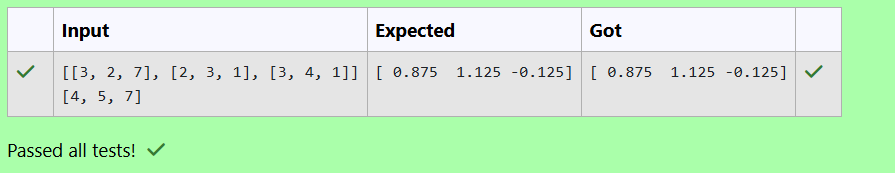

# LU Decomposition 

## AIM:
To write a program to find the LU Decomposition of a matrix.

## Equipments Required:
1. Hardware – PCs
2. Anaconda – Python 3.7 Installation / Moodle-Code Runner

## Algorithm
1. Start the program and read the order and elements of the matrix (A).
2. Initialize lower triangular matrix (L) and upper triangular matrix (U).
3. Apply LU decomposition formulas to compute elements of (L) and (U).
4. Display the matrices (L) and (U) and stop the program.

## Program:
(i) To find the L and U matrix
```
#Use LU Decomposition to find L and U matrix.
#Developed by: Harshitha HV
#RegisterNumber: 212225230098
import os 
os.environ["OPENBLAS_NUM_THREADS"]="1"
import numpy as np
from scipy.linalg import lu
matrix = np.array(eval(input()))
P,L,U=lu(matrix)
print(L)
print(U)


```
(ii) To find the LU Decomposition of a matrix
```
'''Program to solve a matrix using LU decomposition.
Developed by: Harshitha HV
RegisterNumber: 212225230098
'''

# To print X matrix (solution to the equations)
import os 
os.environ["OPENBLAS_NUM_THREADS"]="1"
import numpy as np
from scipy.linalg import lu_factor,lu_solve
matrix= np.array(eval(input()))
constant= np.array(eval(input()))
piv,lu= lu_factor(matrix)
result= lu_solve((piv,lu),constant)
print(result)
```

## Output:



## Result:
Thus the program to find the LU Decomposition of a matrix is written and verified using python programming.

